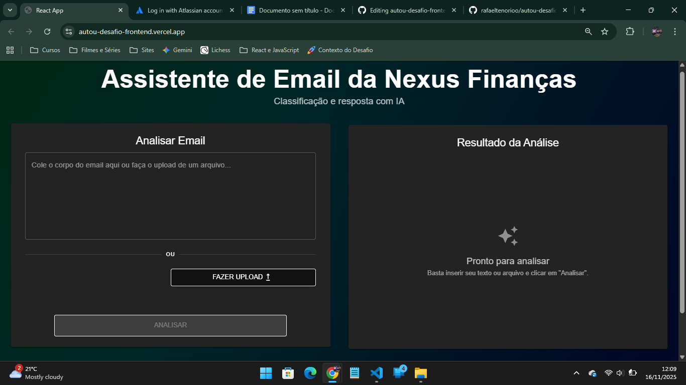
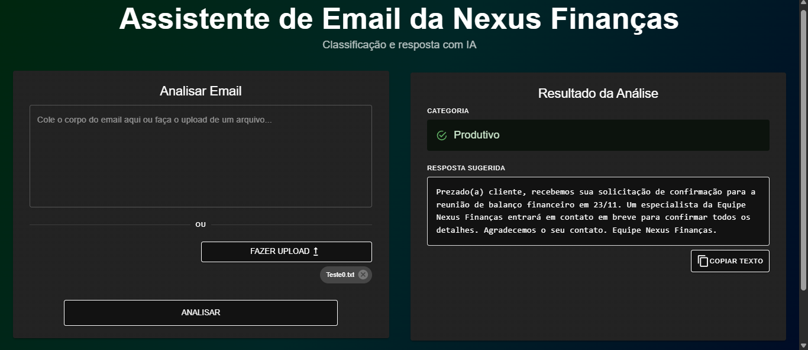

# Assistente de emails UI (Frontend) - Desafio AutoU

Esta é a interface de usuário (UI) para o desafio técnico da AutoU. A aplicação foi construída para ser uma ferramenta de triagem de e-mail limpa, profissional e 100% responsiva.

Esta aplicação cumpre todos os critérios de UI, incluindo o "Capricho visual ou recursos adicionais".

---

## 🚀 Link da Aplicação Ao Vivo (Vercel)

**`https://autou-desafio-frontend.vercel.app/`**

> **⚠️ Aviso Importante (Cold Start)**
> O backend (API) está hospedado no plano gratuito do Render.com. A **primeira** análise do dia pode levar de 30 a 60 segundos para "acordar" o servidor. As análises seguintes serão rápidas.

---

## 📸 Screenshots

Aqui está uma prévia da aplicação em "Dark Mode". O design é 100% responsivo, adaptando-se do desktop ao mobile.


 |  

---

## 🛠️ Stack de Tecnologia

* **React:** Para toda a interface e gerenciamento de estado.
* **Material-UI (MUI):** Para o "Dark Mode", sistema de Grid responsivo e todos os componentes de UI (Cards, Botões, Alertas, etc.).
* **Vercel:** Plataforma de deploy (hospedagem).

---

## 🚀 Como Executar Localmente

Siga estas instruções para rodar o projeto em sua máquina local.

### 1. Clonar o Repositório

git clone [https://github.com/rafaeltenorioo/autou-desafio-frontend.git] cd autou-desafio-frontend

### 2. Instalar Dependências

npm install

### 3. Conectar ao Backend
Este projeto precisa que o [servidor da API (backend)]([https://github.com/rafaeltenorioo/autou-desafio-backend]) esteja rodando.

* No arquivo `src/App.js` (ou onde sua função `handleSubmit` estiver), certifique-se de que o `fetch` aponta para o endereço do seu backend local:
    ```javascript
    const response = await fetch(
      "[http://127.0.0.1:5000/process-email](http://127.0.0.1:5000/process-email)", 
      { ... }
    );
    ```

### 4. Rodar a Aplicação

npm start

O site estará disponível em `http://localhost:3000`.
